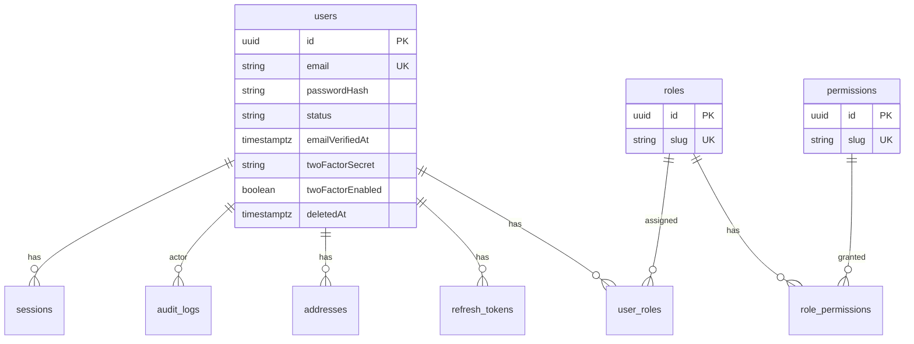
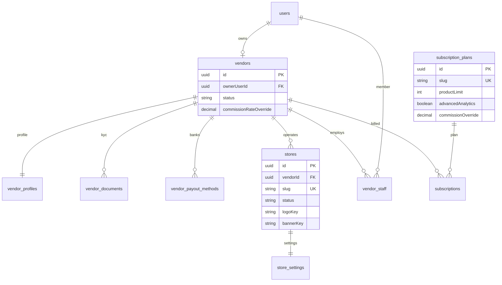
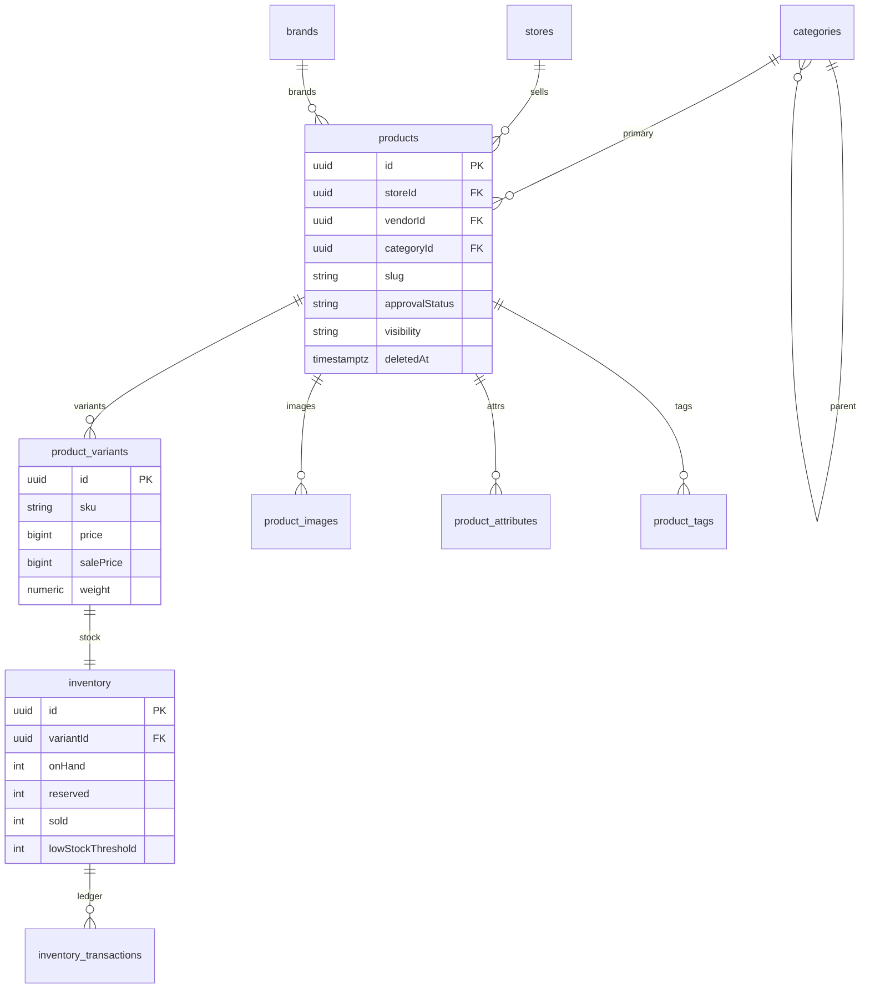
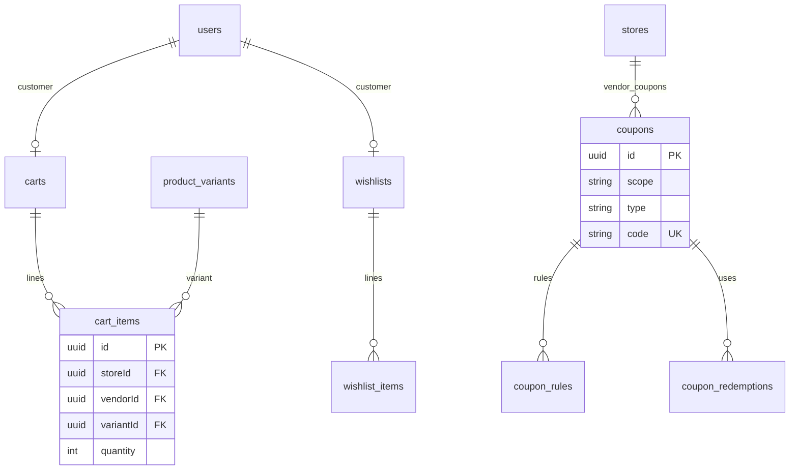
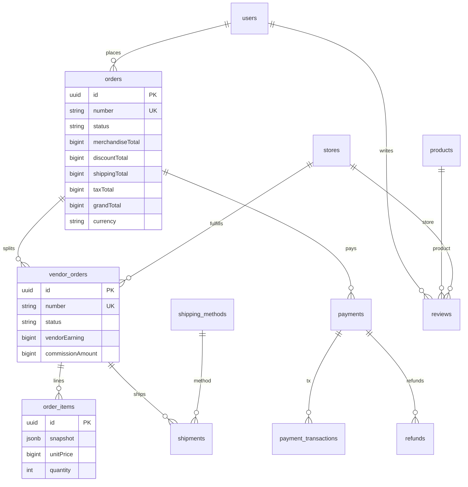
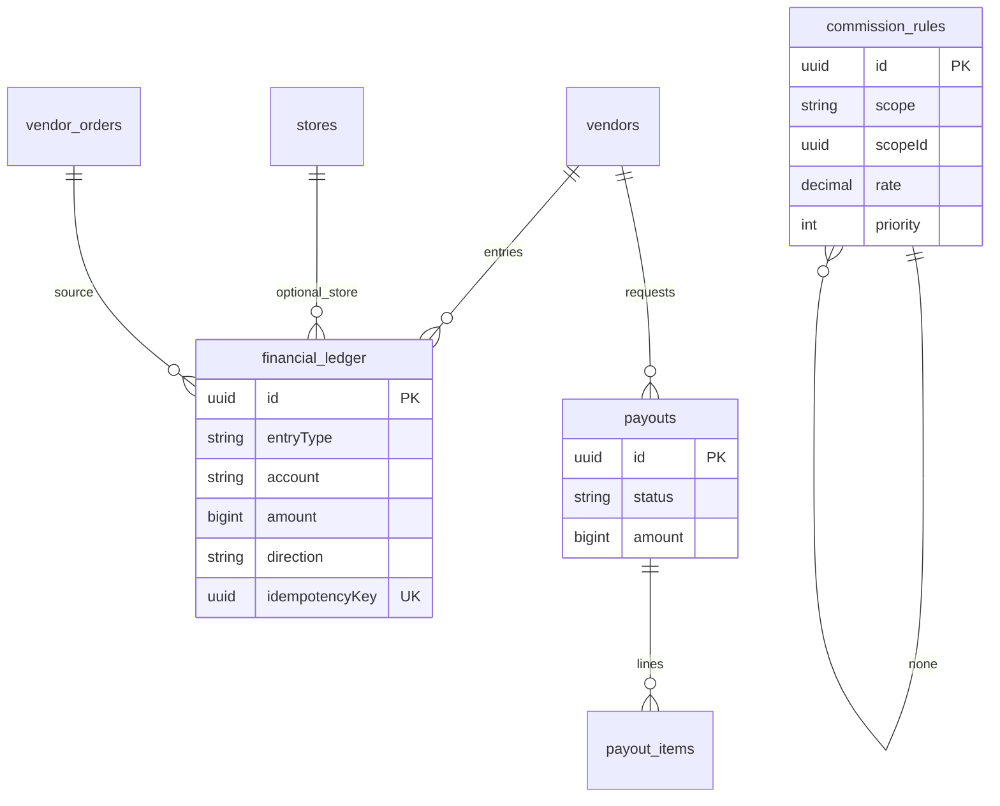
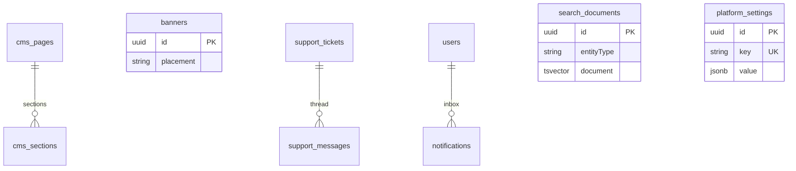

# C. Database ERD

PostgreSQL + Prisma. All PKs UUID. Timestamps `createdAt`/`updatedAt` everywhere. Financial amounts: `BigInt` minor units + `currency CHAR(3)`.

## 1. Identity and access

Seed roles: `admin`, `support`, `vendor_owner`, `vendor_staff`, `customer`. Permissions are fine-grained (`products:write`, `payouts:request`, …).

## 2. Vendors, stores, subscriptions

Vendor status: `PENDING_ONBOARDING`, `PENDING_REVIEW`, `APPROVED`, `REJECTED`, `SUSPENDED`.  
Store status: `DRAFT`, `ACTIVE`, `PAUSED`, `CLOSED`.

## 3. Catalog and inventory

`available = onHand - reserved`. Transactions: `RESERVE`, `RELEASE`, `COMMIT_SALE`, `ADJUST`, `RETURN`.

## 4. Cart, wishlist, coupons

Coupon `scope`: `PLATFORM` | `VENDOR`. Types: `PERCENT`, `FIXED`, `FREE_SHIPPING`.

## 5. Orders, shipping, payments, reviews

## 6. Ledger, commissions, payouts

Ledger accounts include `VENDOR_PENDING`, `VENDOR_AVAILABLE`, `VENDOR_PAID`, `PLATFORM_COMMISSION`, `PLATFORM_PROMOTION_EXPENSE`, `TAX_PAYABLE`, `CUSTOMER_PAYMENT`.  
`direction`: `DEBIT` | `CREDIT`. Double-entry: every event posts ≥2 rows in one transaction.

## 7. CMS, support, notifications, search

## 8. Indexing (minimum)

- Unique: `users.email`, `stores.slug`, `products(storeId, slug)`, `product_variants(storeId, sku)` (sku unique per store), `orders.number`, `coupons.code`  
- `products(categoryId, approvalStatus, visibility, deletedAt)`  
- `order_items(vendorOrderId)`, `vendor_orders(vendorId, status)`  
- `financial_ledger(vendorId, account, createdAt)`  
- GIN on `search_documents.document`; trigram on product name  
- `audit_logs(actorUserId, entityType, entityId, createdAt)`

## 9. Integrity

FKs with `ON DELETE RESTRICT` for financial/order graphs. Check: `onHand >= 0`, `reserved >= 0`, `quantity > 0`, `rate` between 0 and 1, `grandTotal >= 0`. Partial unique indexes for one active cart per user.
